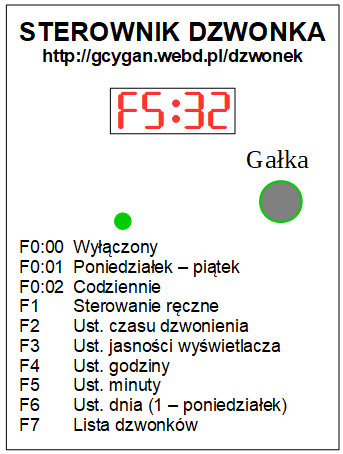

<h1 style="text-align: center">Instrukcja obsługi sterownika dzwonka szkolnego</h1>

<h2 style="text-align: center">Zmiana ustawień godziny i innych parametrów</h2>
<ol>
<li>Po wciśnięciu gałki na wyświetlaczu pojawi się komunikat podobny do tego: 
F1:
</li>
<li>Kręcąc gałką wybieramy żądaną funkcję. Przykładowo. Po wybraniu funkcji Ustawianie godziny na wyświetlaczu pojawi się komunikat: 
F4:
</li>
<li>Po wciśnięciu gałki na wyświetlaczu pojawi się komunikat podobny do tego: 
F4:12
</li>
<li>Kręcąc gałką należy ustawić żądaną godzinę.</li>
<li>Należy przycisnąć gałkę, aby zapisać godzinę w pamięci sterownika. Jeżeli gałka nie zostanie przyciśnięta w ciągu dziesięciu sekund, ustawiona wartość nie zostanie zapamiętana.</li>
</ol>

W analogiczny sposób należy postępować w przypadku ustawiania minut i pozostałych funkcji.

<h2 style="text-align: center">Ręczne włączanie dzwonka</h2>
<li>Aby włączyć dzwonek w dowolnym momencie, należy nacisnąć gałkę.
<li>Następnie, obracając gałkę, wybrać funkcję F1 – Sterowanie ręczne i ponownie ją nacisnąć.
<li>Dzwonek będzie działał przez czas określony parametrem F2 – Czas dzwonienia.
<li>Naciśnięcie gałki w trakcie dzwonienia spowoduje jego natychmiastowe przerwanie.
<h2 style="text-align: center">Wykaz funkcji</h2>
<table width="100%" cellpadding="4" cellspacing="0" border="1">
	<tr>
		<td rowspan="3">
			
<b>F0</b>

		</td>
		<td rowspan="3">
			
Tryb pracy

		</td>
		<td>
			
F0:00 wyłączony

		</td>
	</tr>
	<tr>
		<td>
			
F0:01 poniedziałek &ndash; piątek

		</td>
	</tr>
	<tr>
		<td>

			F0:02
			codziennie

		</td>
	</tr>
	<tr>
		<td>
			
<b>F1</b>

		</td>
		<td>
			
Sterowanie ręczne

		</td>
		<td>
		</td>
	</tr>
	<tr>
		<td>
			
<b>F2</b>

		</td>
		<td>
			
Czas dzwonienia

		</td>
		<td>
			
F2:01 &ndash; F2:09 (1s &ndash; 9s)

		</td>
	</tr>
	<tr>
		<td>
			
<b>F3</b>

		</td>
		<td>
			
Jasność wyświetlacza

		</td>
		<td>
			
F3:00 &ndash; F3:04

		</td>
	</tr>
	<tr>
		<td>
			
<b>F4</b>

		</td>
		<td>
			
Ustawianie godziny

		</td>
		<td>
			
F4:00 &ndash; F4:23

		</td>
	</tr>
	<tr>
		<td>
			
<b>F5</b>

		</td>
		<td>
			
Ustawianie minuty

		</td>
		<td>
			
F5:00 &ndash; F5:59

		</td>
	</tr>
	<tr>
		<td>
			
<b>F6</b>

		</td>
		<td>
			
Ustawianie dnia tygodnia

		</td>
		<td>
			
F6:01 &ndash; F6:07 (poniedziałek &ndash; niedziela)

		</td>
	</tr>
	<tr>
		<td>
			
<b>F7</b>

		</td>
		<td>
			
Wyświetlenie listy dzwonków

		</td>
		<td>
		</td>
	</tr>
	<tr>
		<td>
			
<b>FA</b>

		</td>
		<td>
			
Dodawanie nowego dzwonka do listy dzwonków

		</td>
		<td>
		</td>
	</tr>
	<tr>
		<td rowspan="3">
			
<b>Fb</b>

		</td>
		<td rowspan="3">
			
Bank dzwonków

		</td>
		<td>
			
Fb:00 normalne (45 min.)

		</td>
	</tr>
	<tr>
		<td>
			
Fb:01 skrócone (30 min.)

		</td>
	</tr>
	<tr>
		<td>
			
Fb:02 skrócone (35 min.)

		</td>
	</tr>
	<tr>
		<td>
			
<b>FC</b>

		</td>
		<td>
			
Modyfikacja listy dzwonków

		</td>
		<td>
		</td>
	</tr>
	<tr>
		<td>
			
<b>FE</b>

		</td>
		<td>
			
Usunięcie z listy dzwonków

		</td>
		<td>
		</td>
	</tr>
</table>

<h2 style="text-align: center">Programowanie listy dzwonków przy pomocy komputera</h2>
<ol>
<li>Sterownik podłączyć do komputera przy pomocy przewodu USB mini.</li>
<li>Proszę sprawdzić w menedżerze urządzeń, na którym porcie COM pojawi się sterownik dzwonka USB-SERIAL CH340. Zapisać numer portu, bo będzie potrzebny w punkcie 3. W razie potrzeby zainstalować sterowniki do układu CH340.</li>
<li>Na komputerze uruchomić program putty (może być użyty dowolny tzw. emulator terminala RS232). Ustawić parametry transmisji:
<ul>
<li>Speed 19200,</li>
<li>Serial line COM<numer> (ten odczytany w punkcie 2),</li>
<li>Connection type: Serial.</li>
</li>
</ul>
<li>Po wciśnięciu klawisza Enter sterownik pokaże listę dostępnych poleceń. Należy wiedzieć, że wszystkie podawane wartości są muszą być dwucyfrowe, np godzinę 7 zapisujemy jako 07.</li>
</ol>

